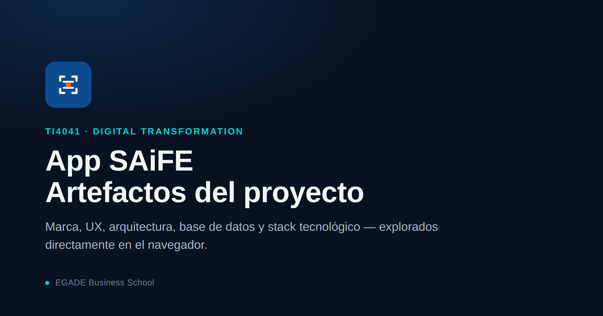

# App SAiFE · Artefactos del proyecto

Página de artefactos del proyecto **App SAiFE**, desarrollada para el curso **TI4041 · Digital Transformation** (EGADE Business School).

Reúne en un solo lugar el briefing automatizado de clientes, la marca, el prototipo UX, la arquitectura del sistema con su stack, el modelo de base de datos y una demo en vivo del dashboard — todo explorable directamente en el navegador, sin descargas.



## Ver la página

Una vez habilitado GitHub Pages en este repositorio, la página estará disponible en:

```
https://alvarezclaudia.github.io/EGADE-TI4041/
```

Mientras tanto, `index.html` puede abrirse directamente en cualquier navegador.

## Contenido

- **Briefing de clientes** — briefing de reunión que Claude prepara solo cada mañana leyendo correo y calendario, con la explicación de cómo se crea la tarea programada.
- **Guía de marca SAiFE** — símbolo, ícono de app y usos incorrectos.
- **Sistema de marca SAiFE** — construcción del símbolo, retícula, color y tipografía.
- **Propuestas de mejora UX/UI** — prototipo interactivo de 8 pantallas.
- **Arquitectura y stack tecnológico** — flujo de datos entre la app móvil, Supabase y el dashboard web, con enlace a cada herramienta usada.
- **Dashboard web (demo en vivo)** — panel de solo lectura desplegado en Vercel.
- **Esquema de base de datos** — modelo entidad-relación simplificado de Supabase.

## Publicar en GitHub Pages

1. Sube `index.html`, `og-image.png`, `README.md` y `LICENSE.md` a la raíz de este repositorio (rama `main`).
2. Ve a **Settings → Pages**.
3. En **Build and deployment**, elige **Deploy from a branch**.
4. Selecciona la rama `main` y la carpeta `/ (root)`.
5. Guarda. La página quedará disponible en `https://alvarezclaudia.github.io/EGADE-TI4041/` en un par de minutos.

## Licencia

Este material se comparte bajo la licencia **Creative Commons Attribution 4.0 International (CC BY 4.0)**, con excepciones para la identidad de marca EGADE (adaptada de Tecnológico de Monterrey) y los artefactos propios del proyecto SAiFE (propiedad de Slimrack SAS). Ver el texto completo en [`LICENSE.md`](./LICENSE.md).

---

Claudia Alvarez · EGADE Business School
